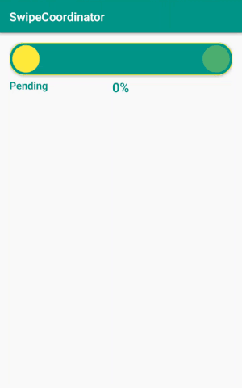
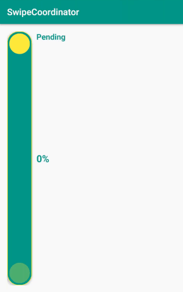

# SwipeCoordinator

SwipeCoordinator simplifies the processs of implementing animated swipeable views. It links a view with its parent as a single behavioural unit constrained by the parent boundaries. SwipeCoordinator supports both *left-to-right* and *top-to-bottom* direction.






## SetUp

Add to top level *gradle.build* file

```gradle
allprojects {
    repositories {
        maven { url "https://jitpack.io" }
    }
}
```

Add to app module *gradle.build* file
```gradle
dependencies {
    androidTestCompile 'com.github.VictorAlbertos:SwipeCoordinator:0.0.1'
}
```

## Usage

Identify the swipeable view with `@id/swipeable_view` attribute.  

```xml
<RelativeLayout
	  android:id="@+id/parent_swipeable_view"
      android:layout_width="match_parent"
      android:layout_height="?attr/actionBarSize"
      android:background="@color/colorPrimary">

    <View
        android:id="@id/swipeable_view"
        android:layout_width="?attr/actionBarSize"
        android:layout_height="?attr/actionBarSize"
        android:background="@color/colorAccent"/>

</RelativeLayout>
```

Create an instance of `SwipeCoordinator` suppliyng as argument constructor the parent layout of the swipeable view, and the expected direction for the swipe gesture. 

```java
ViewGroup parentSwipeableView = (ViewGroup) findViewById(R.id.parent_swipeable_view);
    SwipeCoordinator swipeCoordinator =
        new SwipeCoordinator(parentSwipeableView, SwipeDirection.LEFT_TO_RIGHT);
```

### ActionUpSwipeListener
`ActionUpSwipeListener` signals the `MotionEvent` `ACTION_UP` of the swipeable view providing a `boolean` as a flag to indicate if the action took place surpassing the threshold value. This callback is the place to determine if the user fulfilled the motion event. 

```java
swipeCoordinator.setOnActionUpSwipeListener(new SwipeCoordinator.ActionUpSwipeListener() {
  @Override public void onActionUp(boolean thresholdReached) {
    if (thresholdReached) Toast.makeText(this, "Approved", Toast.LENGTH_SHORT).show();
    else Toast.makeText(this, "Pending", Toast.LENGTH_SHORT).show();
  }
});
```

### ProgressListener
`ProgressListener` emits the progress of the swipeable view. From 0 to 1, this value represent in percentage the left distance to its fulfilled position. This callback is the perfect place to create animations based on the progress value.

```java
swipeCoordinator.setProgressListener(new SwipeCoordinator.ProgressListener() {
  @Override public void onProgress(float progress) {
    tvAccepted.setScaleX(progress);
    tvAccepted.setScaleY(progress);
    tvAccepted.setAlpha(progress);
  }
});
```

### Survive to config changes
`SwipeCoordinator` exposes `doSwipe` method. It translates the swipeable view to the fulfilled stage and calls `ProgressListener::onProgress(progress)` with a value of 1.0 to restore all the dependent state views (scale, alpha...).


### Customization

#### Threshold
The value in percentage of the threshold to signal it as reached when the user drops the swipeable view. From 0 to 1, being the default value 0.7.

```java
swipeCoordinator.setThreshold(0.5f);
```

#### Variance percentage
Increment (if number greater than 1.0) or decrement (if number less than 1.0) the duration of the rearrange animation performed when the user drops the swipeable view. Default value is 1.0.

```java
swipeCoordinator.setThreshold(0.5f);
```

## Author

**Víctor Albertos**

* <https://twitter.com/_victorAlbertos>
* <https://www.linkedin.com/in/victoralbertos>
* <https://github.com/VictorAlbertos>


## Another author's libraries:
* [BreadcrumbsView](https://github.com/VictorAlbertos/BreadcrumbsView): A customizable Android view for paginated forms.
* [Mockery](https://github.com/VictorAlbertos/Mockery): Android and Java library for mocking and testing networking layers with built-in support for Retrofit.
* [ReactiveCache](https://github.com/VictorAlbertos/ReactiveCache): A reactive cache for Android and Java which honors the Observable chain.
* [RxActivityResult](https://github.com/VictorAlbertos/RxActivityResult): A reactive-tiny-badass-vindictive library to break with the OnActivityResult implementation as it breaks the observables chain. 